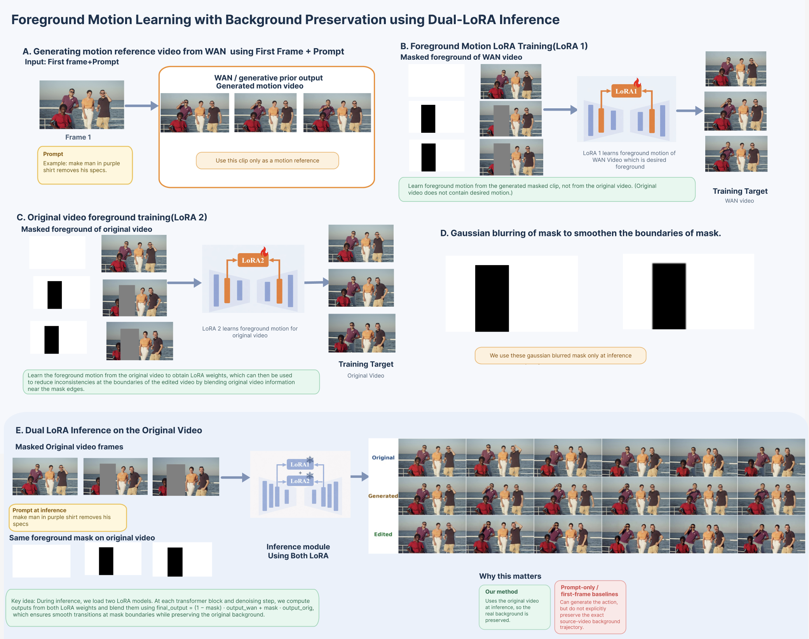
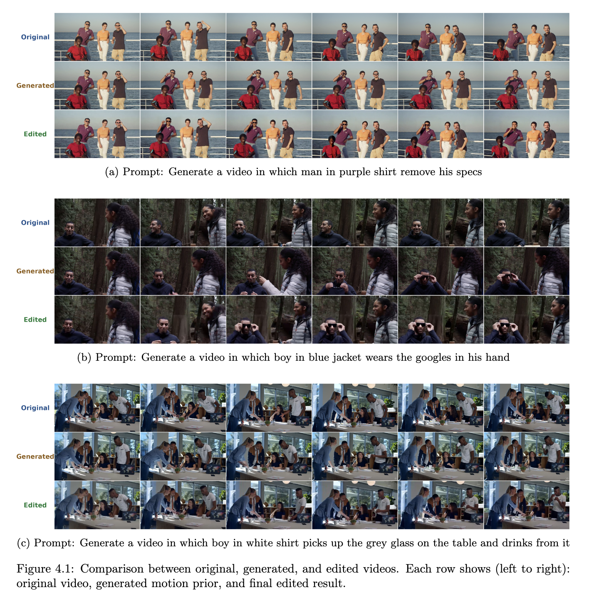

# Foreground Motion Editing with Background Preservation using Dual-LoRA Inference

> **Built on top of [LoRA-Edit](https://github.com/cjeen/LoRAEdit)** — we extend the original pipeline with a dual-LoRA inference strategy that enables high-quality foreground motion transfer from I2V-generated videos (containing the desired foreground motion) while preserving the exact background trajectory of the original video.

---

## 🔍 Method Overview

<div align="center">
  
</div>

Our method addresses a key limitation of existing I2V editing pipelines: **generated videos do not preserve the original video's background motion**. We solve this with a two-LoRA approach:

| Component | Role |
|-----------|------|
| **LoRA 1** | Trained on the **masked foreground of the I2V-generated video** (which contains the desired foreground motion) — learns the target motion |
| **LoRA 2** | Trained on the **masked foreground of the original video** — learns original scene motion |
| **Dual-LoRA Inference** | Both LoRAs run simultaneously; outputs are blended using a Gaussian-smoothed mask at each transformer block and denoising step |

### Key Idea

At inference, for each transformer block:

```
final_output = output_wan × mask + output_orig × (1 - mask)
```

The mask is **Gaussian-blurred** to smooth boundary transitions, which eliminates border jitter while preserving the original background trajectory exactly.

---

## 🎬 Results

Each group below shows (left → right): original video frames, WAN-generated motion prior, and final dual-LoRA edited output.

<div align="center">
  
</div>

> **Row legend:** 🔵 *Original* — 🟠 *Generated (motion prior)* — 🟢 *Edited (our output)*

---

## 🛠️ Environment Setup

### Prerequisites
- CUDA-compatible GPU with sufficient VRAM (tested on RTX 4090 / 24 GB)
- Python 3.12 (recommended)
- Git, Miniconda or Anaconda

### 1. Clone Repository

```bash
git clone --recurse-submodules https://github.com/harshit08042006/LoRAEdit.git
cd LoRAEdit

# If you already cloned without submodules:
# git submodule init && git submodule update
```

### 2. Install PyTorch

Choose the command matching your CUDA version ([PyTorch official](https://pytorch.org/get-started/locally/)):

```bash
# CUDA 11.8
pip install torch torchvision torchaudio --index-url https://download.pytorch.org/whl/cu118

# CUDA 12.1
pip install torch torchvision torchaudio --index-url https://download.pytorch.org/whl/cu121

# CUDA 12.4
pip install torch torchvision torchaudio --index-url https://download.pytorch.org/whl/cu124
```

### 3. Install Dependencies

```bash
pip install -r requirements.txt
```

### 4. Download Models

> **Note:** Model weights are **not included in this repository** (they are too large for GitHub). You must download them separately before running anything.

#### Wan2.1-I2V-14B-480P
```bash
pip install huggingface_hub
huggingface-cli download Wan-AI/Wan2.1-I2V-14B-480P --local-dir ./Wan2.1-I2V-14B-480P
```

#### SAM2 Checkpoint
```bash
mkdir -p models_sam
wget https://dl.fbaipublicfiles.com/segment_anything_2/072824/sam2_hiera_large.pt \
     -O models_sam/sam2_hiera_large.pt
```

---

## 🚀 Full Pipeline

### Phase A — Process the Original Video (LoRA 2)

**Step A-1: Foreground Selection & Data Preprocessing**

Launch the interactive segmentation interface and upload your **original video**. Select the foreground object you want to keep/transfer motion from.

```bash
python predata_app.py --port 8890 --checkpoint_dir models_sam/sam2_hiera_large.pt
```

The interface will auto-generate the training command. Run it:

**Step A-2: LoRA 2 Training**

```bash
NCCL_P2P_DISABLE="1" NCCL_IB_DISABLE="1" \
  deepspeed --num_gpus=1 train.py --deepspeed \
  --config ./processed_data/<original_sequence>/configs/training.toml
```

> Replace `<original_sequence>` with the folder name generated under `processed_data/`.

---

### Phase B — Process the I2V Reference Video (LoRA 1)

**Step B-1: Generate the I2V Reference Video**

Use any Image-to-Video (I2V) model (WAN 2.1, VEO, etc.) with the **first frame of the original video + your edit prompt** to generate a video that contains the desired foreground motion. This video is used **only as a motion reference** — not as the final output.

> Example prompt: *"make the man in the purple shirt remove his specs"*

**Step B-2: Set the Inference Prompt**

After preprocessing the generated video, open the `prefix.txt` file inside its processed data folder and write the prompt that describes the desired edit. This prompt is used during dual-LoRA inference.

```bash
# Example:
echo "Generate a video in which man in purple shirt removes his specs" \
  > ./processed_data/<generated_sequence>/prefix.txt
```

> ⚠️ **This step is required.** The inference script reads `prefix.txt` as the conditioning prompt. Without it, inference will fail or produce incorrect results.

**Step B-3: Foreground Selection & Data Preprocessing**

Launch the preprocessing interface again with the **generated video**. Select the **same foreground region** as Phase A.

```bash
python predata_app.py --port 8890 --checkpoint_dir models_sam/sam2_hiera_large.pt
```

**Step B-3: LoRA 1 Training**

```bash
NCCL_P2P_DISABLE="1" NCCL_IB_DISABLE="1" \
  deepspeed --num_gpus=1 train.py --deepspeed \
  --config ./processed_data/<generated_sequence>/configs/training.toml
```

---

### Phase C — Link the Two Sequences

After both trainings are complete, copy the **original video's `inference_rgb.mp4`** into the **generated video's processed data folder**, replacing the generated one:

```bash
cp ./processed_data/<original_sequence>/inference_rgb.mp4 \
   ./processed_data/<generated_sequence>/inference_rgb.mp4
```

This ensures the dual-LoRA inference runs on the original video's RGB frames (preserving the real background), while using the generated video's mask.

---

### Phase D — Dual-LoRA Inference

```bash
python inference_dual_lora.py \
    --model_root_dir ./Wan2.1-I2V-14B-480P \
    --wan_data_dir   ./processed_data/<generated_sequence> \
    --orig_data_dir  ./processed_data/<original_sequence> \
    --border_sigma   3.0
```

| Argument | Description |
|----------|-------------|
| `--model_root_dir` | Path to the Wan2.1-I2V-14B-480P model weights |
| `--wan_data_dir` | Processed data folder for the **generated/edited video** (LoRA 1) |
| `--orig_data_dir` | Processed data folder for the **original video** (LoRA 2) |
| `--border_sigma` | Gaussian blur sigma for mask boundary smoothing (default `3.0`, increase to soften transitions) |

The output video will be saved inside `--wan_data_dir`.

---

## ⚡ Training Cost Reference

All benchmarks are on RTX 4090 at 480P (832×480), trained for 100 steps.

| Frames | Time / Iteration (sec) | VRAM (MB) |
|:------:|:----------------------:|:---------:|
| 5      | 7.55                   | 11,086    |
| 13     | 10.81                  | 12,496    |
| 21     | 14.79                  | 14,456    |
| 49     | 31.88                  | 21,522    |
| 65 †   | 45.71                  | 20,416    |

<sup>† For 65 frames, `blocks_to_swap` was set to 38 instead of the default 32.</sup>

---

## 📁 Directory Structure

```
LoRAEdit/
├── predata_app.py              # Interactive foreground segmentation & preprocessing
├── train.py                    # LoRA training script
├── inference.py                # Single-LoRA inference (original LoRA-Edit)
├── inference_dual_lora.py      # Dual-LoRA inference (our method)
├── dual_lora_utils.py          # Blending utilities for dual-LoRA
├── custom_wan_pipe.py          # Modified WAN pipeline with dual-LoRA hooks
├── models_sam/
│   └── sam2_hiera_large.pt     # SAM2 checkpoint
├── Wan2.1-I2V-14B-480P/        # WAN model weights
├── processed_data/
│   ├── <generated_sequence>/   # LoRA 1 data (edited/generated video)
│   │   ├── source_frames/
│   │   ├── traindata/
│   │   ├── configs/
│   │   ├── lora/
│   │   ├── inference_rgb.mp4   # ← replaced with original video's RGB
│   │   └── inference_mask.mp4
│   └── <original_sequence>/    # LoRA 2 data (original video)
│       ├── source_frames/
│       ├── traindata/
│       ├── configs/
│       ├── lora/
│       ├── inference_rgb.mp4
│       └── inference_mask.mp4
└── requirements.txt
```

---

## 🙏 Acknowledgments

This project is built upon the excellent [LoRA-Edit](https://github.com/cjeen/LoRAEdit) codebase (paper: [arXiv:2506.10082](https://arxiv.org/pdf/2506.10082)). We thank the original authors for open-sourcing their work.

- **[Wan2.1](https://github.com/Wan-Video/Wan2.1)** — Image-to-Video generation backbone
- **[diffusion-pipe](https://github.com/tdrussell/diffusion-pipe)** — Memory-efficient diffusion training
- **[SAM2-GUI](https://github.com/YunxuanMao/SAM2-GUI)** — Interactive segmentation interface
